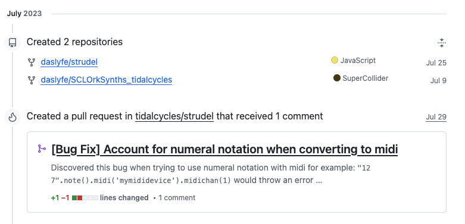

# Switch Angel Presentation 

## Preliminary Research (links and notes)
https://www.instagram.com/p/Bzjx8_KHO0p/ 
https://www.instagram.com/p/Bzo4QGIn8X8/ 
generative music in unity (july 2019)

https://www.instagram.com/p/CB9hcvfJ-rX/ 
https://www.instagram.com/p/CCQuVPKphUX/
https://www.jaderose.red/projects/grainboy/
audio / visual synthesizer created with react + processing (june 2020)

https://www.youtube.com/watch?v=FKM8-UUnNxc
"Started playing around with Tidal Cycles and open source music creation this week. So many possibilities." (june 2023)

switch angel join message in tidal/strudel/uzulangs discord server, plus initial messages

made first pull request and forked repo to self (july 2023)

\[...]
various pull requests and commits

https://codeberg.org/uzu/strudel/releases/tag/v1.2.0
many contributions to 1.2 release, including new features and functions. (may 2025) 
some:
- beat function for step sequencer
- stretch function
- onKey function for key commands
- scrub function
- etc.

[switch angel strudel 1.2 demo song](https://strudel.cc/#Ly9AdGl0bGUgU3RydWRlbCAxLjIgREVNTyBAYnkgU3dpdGNoIEFuZ2VsICsgPz8KYXdhaXQgc2FtcGxlcygnZ2l0aHViOnN3aXRjaGFuZ2VsL2JyZWFrcycpCmF3YWl0IHNhbXBsZXMoJ2dpdGh1Yjpzd2l0Y2hhbmdlbC9wYWQnKQpzZXRDcHMoMTYwLzYwLzQpCgovLyBzZXRNYXhQb2x5cGhvbnkoMSkKCiRkcnVtczogcygiYnJlYWtzOjIvMiIpLmZpdCgpLnNjcnViKCIwQDMgMEA1IikuY3J1c2goOCkKLnN0cmV0Y2goc2xpZGVyKDAsMCwzLC4xKSkuX3B1bmNoY2FyZCh7aGVpZ2h0OjEyfSkKCiQ6IHMoInB1bHNlIikuYmVhdCgiMCwyLDksMTEiLDE2KS5ub3RlKCJjMiIpLnBlbnYoMzYpLnBkZWNheShzbGlkZXIoMC4wODgsMCwxKSkuZGVjYXkoLjIpCgokOiBzKCJwaW5rLCBwdWxzZSIpLm5vdGUoImMyIikuYmVhdCgiNCwxMCIsMTYpLmRlY2F5KC4xKS5nYWluKDEpLnBlbnYoMjQpLnBkZWNheSguMykucHcoLjcpLnJlbCguMSkucHJlbCguMykKCiRsZWFkOiBpcmFuZCg4KS5zZWcoOCkuc2NhbGUoIkc6TUlOT1I6UEVOVEFUT05JQyIpLm5vdGUoKS5yaWIoNCwxKQoucygicHVsc2UiKQogIC5wdygiMC4zIDAuNSAwLjcgMC4yIikKICAucHdyYXRlKCIyMCIpCiAgLnB3c3dlZXAoc2xpZGVyKDAsMCwxLC4xKSkKLl9zY29wZSgpCgokYmFzczogbm90ZSgie2MyITMyIGEjMSEzMn0lOCIKICAuYWRkKCJ7MCAxMiAwIDAgMTIgMCAwIDEyfSU4IikKICApLnMoInB1bHNlIikKICAucHcoIi41IikKICAucHdyYXRlKCIyIikKICAucHdzd2VlcCguNCkKICAuZm0oc2xpZGVyKDAsMCw4LC4xKSkuZm1lbnYoOCkuZm1kZWNheSguNCkuZm1zdXN0YWluKDApLmZtaCgxLjAxKQogIC5kaXN0b3J0KCIzOi4yIikuX3Njb3BlKCkKCiRwYWQ6IHMoInN3cGFkIikuc2NydWIoIjAuNUAzIC4yQDUiKS5nYWluKDEuMykuYXR0KDAuMikuY29hcnNlKDEyKQo%3D)
includes some of the functions listed above
